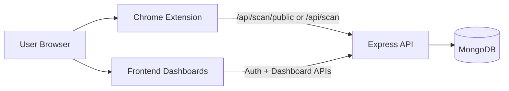

# RUDRAKSHA: The Saviour

<div align="center">

### Phishing URL Detection Chrome Extension + Admin/User Dashboard


</div>

---

## What This Project Does

`RUDRAKSHA: The Saviour` helps detect suspicious and malicious URLs in two ways:

- **Chrome Extension**: checks URLs and can block access with a decision screen.
- **Web Dashboards**:
  - **User dashboard** for scan, history, and reports.
  - **Admin dashboard** for threats, users, and analytics.

The backend currently uses a **heuristic risk engine** (no external paid API required to run locally).

## Core Features

- Real-time URL scan with verdict (`safe`, `suspicious`, `malicious`) and risk score.
- Auto block/intercept experience in extension (user must decide for risky links).
- Optional login/signup inside extension.
- Scan history for authenticated users.
- Admin user management (create/edit user, role/status updates).
- Threat management with status/level updates.
- Analytics overview + trend and distribution charts.

## Tech Stack

- **Backend**: Node.js, Express, MongoDB, Mongoose, JWT, bcrypt
- **Frontend**: HTML/CSS/Vanilla JS (Admin + User dashboards)
- **Extension**: Chrome Extension Manifest V3

## Project Structure

```text
Capstone/
|- backend/
|  |- config/
|  |- controllers/
|  |- middleware/
|  |- models/
|  |- routes/
|  `- server.js
|- frontend/
|  |- admin-dashboard/
|  |- user-dashboard/
|  |- css/
|  |- js/
|  `- *.html pages
|- chrome-extension/
|  |- manifest.json
|  |- background.js
|  |- content.js
|  |- popup.html
|  |- popup.js
|  `- icons/
|- .env
|- env.example
`- package.json
```

## Architecture (Quick View)



## Prerequisites

- Node.js `18+`
- MongoDB local instance (or cloud URI)
- Google Chrome (for extension)

## Environment Setup

1. Copy `env.example` to `.env` (or update existing `.env`).
2. At minimum, verify these keys:

```env
PORT=3001
MONGODB_URI=mongodb://localhost:27017/phishing-detection
FRONTEND_URL=http://127.0.0.1:5500
JWT_SECRET=replace-with-strong-secret
BCRYPT_ROUNDS=12
SEED_ADMIN=true
SEED_ADMIN_EMAIL=admin@rudraksha.local
SEED_ADMIN_PASSWORD=StrongAdmin@123
```

Notes:
- If `SEED_ADMIN=true`, an admin user is auto-seeded at backend startup.
- Keep real secrets out of git in production.

## Run the Project

### 1. Install dependencies

```bash
npm install
```

### 2. Start backend API

```bash
npm run dev
```

Backend runs on `http://localhost:3001` by default.

### 3. Start frontend

Serve project root with Live Server (or any static server), typically:

- `http://127.0.0.1:5500/frontend/index.html`

### 4. Load Chrome extension

1. Open `chrome://extensions`
2. Enable **Developer mode**
3. Click **Load unpacked**
4. Select `chrome-extension/`
5. Click **Reload** whenever extension files are changed

## How To Use

### User flow

1. Open `frontend/index.html`
2. Login as user (or register)
3. Scan URLs from User Dashboard
4. Check history and download report CSV

### Admin flow

1. Login as admin
2. Use **Threat Management** to track flagged URLs
3. Use **User Management** to create/update users
4. Open **Analytics** for trends and threat distribution

### Extension flow

1. Click extension popup for manual scan (with optional deep scan)
2. Optional: login/signup in popup to save user history
3. During navigation, suspicious/malicious pages show a blocking decision screen:
   - **Proceed Anyway** (temporary allow)
   - **Go Back** (stay protected)

## Main API Endpoints

### Health
- `GET /api/health`

### Auth
- `POST /api/auth/register`
- `POST /api/auth/login`

### Scan
- `POST /api/scan/public` (no auth)
- `POST /api/scan` (auth)
- `GET /api/scan/history` (auth)
- `GET /api/scan/stats` (auth)

### Admin
- `GET /api/users`
- `POST /api/users`
- `PATCH /api/users/:id`
- `GET /api/threats`
- `PATCH /api/threats/:id`
- `GET /api/analytics`
- `GET /api/analytics/trends`

## Security Notes

- Replace default secrets before production.
- Use HTTPS and secure cookie/session strategy for deployment.
- Restrict CORS origins to trusted domains only.
- Rotate seeded/default passwords immediately.

## Troubleshooting

- **CORS error**: check `FRONTEND_URL` in `.env` and server restart.
- **Port in use**: change `PORT` or stop the conflicting process.
- **Extension shows old name/icon**: reload from `chrome://extensions`.
- **No analytics data**: ensure scans/threats exist in MongoDB.
- **Login fails**: verify seeded admin credentials or create a new user.

## Roadmap

- Real threat intelligence integrations (Google Safe Browsing, PhishTank, OpenPhish).
- Model-based risk scoring.
- Per-user policy controls and stricter block modes.
- Better charting and export formats.
- Deployment-ready Docker setup.

---

Built for practical phishing protection workflows with extension-first interception and dashboard visibility.
